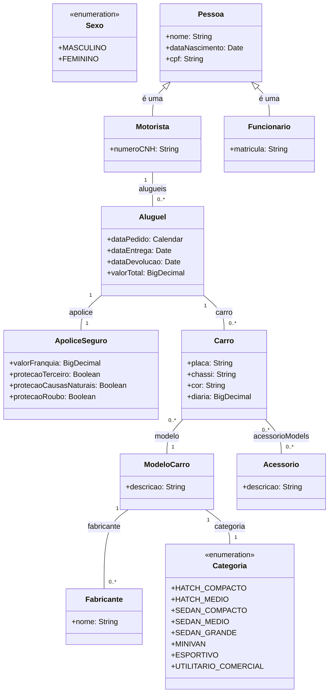

# Desafio locadora de veículos

## Sobre o projeto

Este repositório contém a resolução do Desafio da Locadora de Veículos,
desenvolvido como parte do processo seletivo para o programa Solutis Dev Trail 2024.

## Pré requisitos

- Java JDK 21;
- Apache Maven;
- PostgreSQL;

## Como executar o projeto

- Configure o banco de dados local. Pode-se usar um container no docker: 
```docker run --name postgres-db -p 5432:5432 -e POSTGRES_USER=user -e POSTGRES_PASSWORD=password -e POSTGRES_DB=vehicle-rental -d postgres```;
- Na pasta do código fonte, instale as dependências do Maven: ```mvn install```;
- Configure suas variáveis de ambiente com as credenciais do seu banco de dados
(a assinatura das variáveis está disponível em /src/main/resources/application.yml);
- Execute a aplicação: ```mvn spring-boot:run```;
- A API ficará disponível em http://localhost:8080.

## Diagrama de entidades


