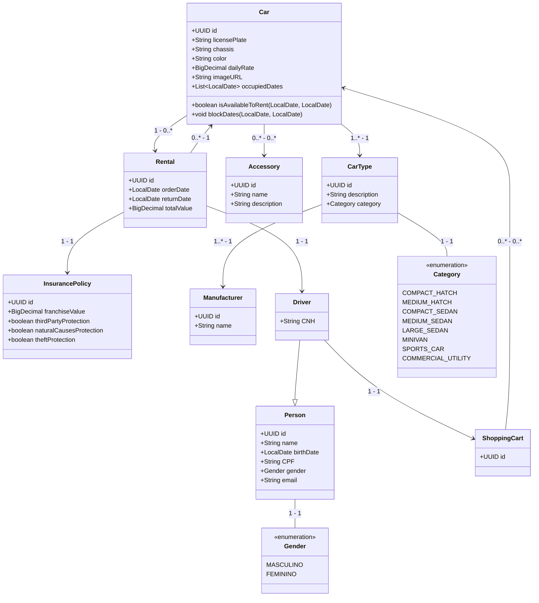

# Desafio locadora de veículos


### Sobre o projeto

Este repositório contém a resolução do Desafio da Locadora de Veículos,
desenvolvido como parte do processo seletivo para o programa Solutis Dev Trail 2024, pela equipe 9.

### Pré requisitos

- Java JDK 21;
- Apache Maven;
- PostgreSQL;
- Docker (Opcional)

### Instalação do Projeto

1. Faça o clone o repositório:
   ```bash
   git clone https://github.com/Ednaxx/locadora-de-veiculos-solutis.git
   ```
2. Navegue até o diretório do projeto:
   ```bash
   cd locadora-de-veiculos-solutis
   ```
3. Execute no terminal para instalação das dependências do projeto:
   ```bash
   mvn install
   ```
4. Com o Docker aberto, execute no terminal, para rodar localmente o banco de dados Postgres:
   ```bash
   docker-compose up --build
   ```
   ou
   ```bash
   docker run --name postgres-db -p 5432:5432 -e POSTGRES_USER=user -e POSTGRES_PASSWORD=password -e POSTGRES_DB=vehicle-rental -d postgres
      ```
   
5. Configure suas variáveis de ambiente com as credenciais do seu banco de dados
(a assinatura das variáveis está disponível em `/src/main/resources/application.yml`);


6. Execute a aplicação:
   ```bash
   mvn spring-boot:run
   ```

7. Utilize a APi com a seguinte url: http://localhost:8080 
   ou via o Swagger da aplicação: [Swager Locadora de Veículos](http://localhost:8080/swagger-ui/index.html#/)

## Diagrama de entidades


## Desenvolvimento

Este projeto foi desenvolvido em colaboração por uma equipe de 7 pessoas.
Cada membro contribuiu com a implementação e validação das soluções propostas para os exercícios.

### Membros da Equipe

- **Alexandre Morais** - https://github.com/Ednaxx

- **Bruno Ricardo Machado** - https://github.com/brunorm86

- **Gabriel Sena** - https://github.com/Gabriel-SBS

- **José Nathan** - https://github.com/josenathan0

- **Junior Aquino** - https://github.com/GitAquino

- **Larissa Sena** - https://github.com/larissacsena

- **Vinícius Almada** - https://github.com/AlmadaAlmada
